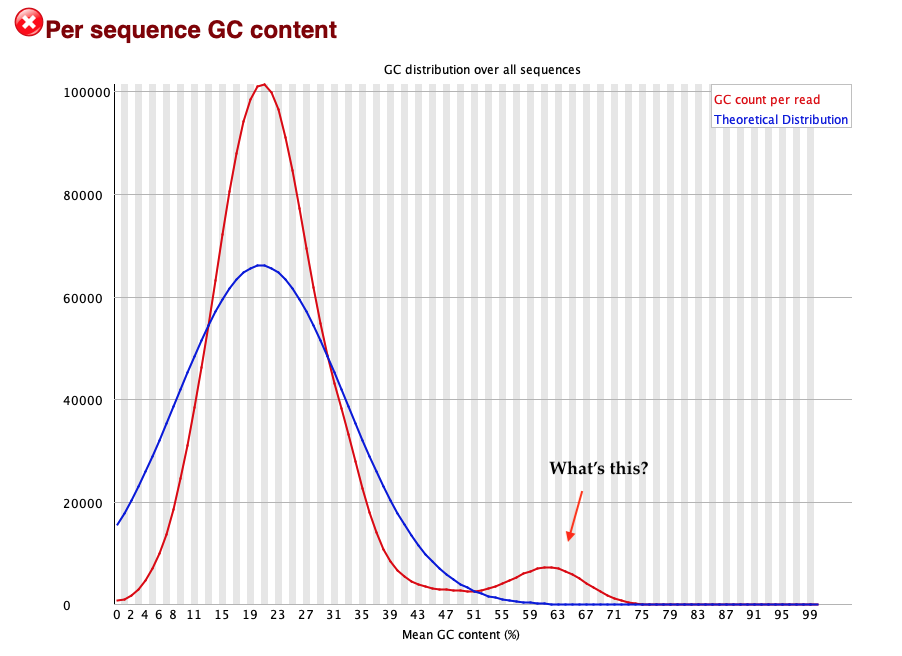
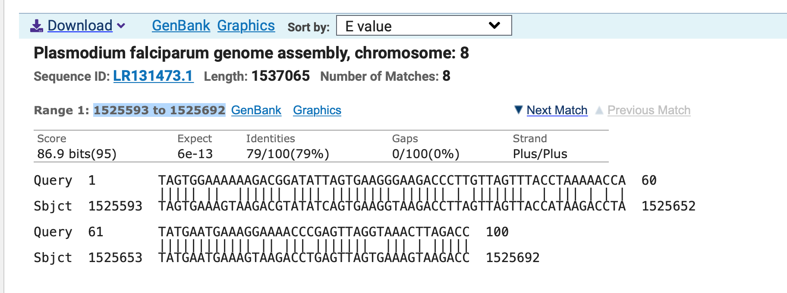

# Challenge questions

We have three challenges.:

* If you want more practice running the pipelines outlined in the practical, try Challenge 1.

* If you have `IGV` installed on your laptop, and want experience visualising reads in the desktop application (IGV),
  try Challenge 2.

* If you want a real challenge understanding the [GC bump](Quality_control.md#per-sequence-gc-content), try Challenge 3.

## Challenge 1: analyse some human data

In the folder `human/` you'll find some data from a human sample - NA12878:

```
ls ~sequence_data_analysis/human/
```

**Challenge.** QC and align this data using the methods described in the practical. Then look at the result 
using `samtools tview`.

**Note.** This data is subsampled to chromosome 19. It is a bit bigger than the malaria data; to
speed this up you can probably get away with using up to 4 threads in the `bwa mem` step - but no
more than 4 please!

A good region to view is around the gene *FUT2*, which is at `chr19:48645971-48755951`.

**Question.** The SNP [rs601338](https://www.ncbi.nlm.nih.gov/snp/rs601338) in the *FUT2*
determines *secretor status*. Being a *non-secretor* means that blood group antigens (encoded by
ABO and other loci) are not secreted or expressed into bodily fluids in the normal way.
Non-secretors are [protected against some pathogens including
*norovirus*](https://www.ncbi.nlm.nih.gov/pmc/articles/PMC6171556/), but are also more susceptible
to others - so it can be medically important what status you have.

Secretor status is a recessive trait, so the table of genotypes and secretor status at rs601338 is:

| genotype | secretor status |
| -------- | --------------- |
| GG       | secretor        |
| GA       | secretor        |
| AA       | non-secretor    |

What genotype does NA12878 have at rs601338?  Are they a secretor or non-secretor?

**Note.** the SNP is at `chr19:48703417` as you can see [on dbSNP](https://www.ncbi.nlm.nih.gov/snp/rs601338).

Look for other variation.  Can you see an indel?

## Challenge 2: explore reads using `IGV`

This challenge is an alternative to Challenge 1 and will **only work if you have IGV installed on your laptop**.
To get set up:

* Start IGV on your laptop (not JupyterHub) and make sure you have selected human build 38 from the 'genomes' drop down.
* Load the track for NA12878 data from the following urls:
```
  BAM URL: https://www.well.ox.ac.uk/~gav/projects/oxford_statgen_summer_school/sequence_data_analysis/solutions/human/
INDEX URL: https://www.well.ox.ac.uk/~gav/projects/oxford_statgen_summer_school/sequence_data_analysis/solutions/human/
```

Now browse the genome in IGV.

**Challenge.** Can you find:

1. a heterozygous SNP?
2. a homozygous SNP?
3. an insertion or deletion?
4. a larger structural variant?
5. a region where the coverage is unusually high (or low)?
6. With reference to **challenge 1**, what is the secretor status of this sample?
7. Can you find a read with clipped bases?  (Hint: to show clipped bases, you need to go to `View->Preferences->Alignments` and turn 'show soft-clipped bases' on.)


### Challenge 3: figure out the GC bump.


**Note.** This is a real challenge.  I don't fully know the answer right now.

In the [QC section](Quality_control.md) we saw this weird pattern of GC content for the malaria sample `QG0033-C`:



**Challenge** figure out what the extra bump is.

**Hints.** 

* Maybe this is some kind of contamination? Since we have aligned the reads to the *P.falciparum*
  genome, we might be able to find the contamination by searching for *unmapped reads*.

* unmapped reads are identified by one of the [SAM
  flags](https://broadinstitute.github.io/picard/explain-flags.html).  To pull them out you could do something like this:
  
```
samtools view -f 4 -o QG0033-C-unaligned.bam QG0033-C.bam
samtools view -F 4 -o QG0033-C-onlyaligned.bam QG0033-C.bam
```

(The `-f` and `-F` option means: exclude or include reads with these flags).

* Now you could run both these bam files through fastqc to estimate the GC content seperately.  Does this explain the bump?

#### Using NCBI BLAST

One way to go further now is to take some reads from the unaligned BAM file and try BLASTing them
to lots of other sequences. You can do that as follows:

* Visit [NCBI blast](https://blast.ncbi.nlm.nih.gov/Blast.cgi) and choose 'Nucleotide BLAST'
* Pick a read from the unaligned BAM and paste its sequence into the 'FASTA sequence' box
* To get this to work, for most reads I found I had to choose the `'Somewhat similar sequences (blastn)` option.

Do the reads align?  To what organism?  What's going on?

**Note**. For example this was one result I got:



You can try looking at where these reads align to (here `Pf3D7_08_v3:1525593-1525692`) e.g. in [PlasmoDB
browser](https://plasmodb.org/plasmo/app/jbrowse?data=/a/service/jbrowse/tracks/default&tracks=gene) or the [Pf3k
browser](https://www.malariagen.net/apps/pf3k/release_3/index.html#genomebrowser). What could be going on?


