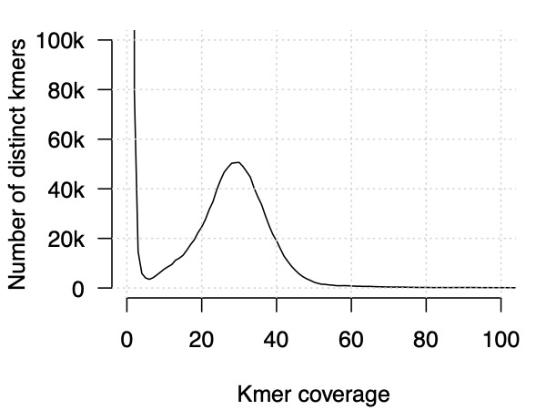

# Appendix - how accurate is Illumina sequencing?

**Note.** Only do this section if you have plenty of time left, and/or have already read the
[section on QC](Quality_control.md) and the section on [aligning reads](Aligning_reads.md). Other
wise please leave for now or come back to it later.

This page shows you another very simple analysis that can be performed directly on a fastq file -
with no need to rely on a reference genome. It is **kmer counting** - that is, we count the number
of occurences of short kmers in the reads and use that to figure out properties of the sequencing.
In principle this can be quite informative, giving us:

* An estimate (albeit crude) of sequencing error rate
* Information about the genome size
* Information about the heterozygosity and the amount of repetitive sequence

We'll do the first of these here, for a more advanced method see [GenomeScope](http://qb.cshl.edu/genomescope/).

## Counting kmers

To make this work well we'll work with a human data sample. (The A/T richness of malaria genomes
leads to uneven coverage, which makes these analyses harder.) We'll use data from the 1000 Genomes
sample NA12878 and count kmers.

To make this practical run in reasonable time, I have generated a smaller version of the data which
contains only reads from a region of the genome. You should be able to find these files here:

```
human/NA12878_ERR3239334-Illumina_Novaseq_6000-chr19_region-read1.fastq.gz
human/NA12878_ERR3239334-Illumina_Novaseq_6000-chr19_region-read2.fastq.gz
```

**Note.** We looked at the fastqc output from this sample already - see it here if you want a refresh:
[read 1 link](ERR3239334-Illumina_NovaSeq_6000_read1_fastqc.html)
[read 2 link](ERR3239334-Illumina_NovaSeq_6000_read2_fastqc.html).

To count kmers we will use [`jellyfish`](https://github.com/zippav/Jellyfish-2).  First let's change into the right directory:

```
cd ~/sequence_data_analysis/human
```

Now Jellyfish can be run like this:
```
jellyfish count -C -m 31 -s 10M -o NA12878_Illumina-Novaseq_6000.jf <(zcat NA12878_ERR3239334-Illumina_Novaseq_6000-chr19_region-read2.fastq.gz) <(zcat NA12878_ERR3239334-Illumina_Novaseq_6000-chr19_region-read1.fastq.gz)
```

**Note.** The funny syntax involving `zcat` and `<()` is used because jellyfish does not directly
support decompression of these gzipped files.  We run `zcat` and redirect it into `jellyfish`.

This should take a couple of minutes. If you type `ls` you'll see Jellyfish has output a new file,
ending `.jf`. This file contains a list of all 31bp kmers present in the reads and the number of
times each one was observed. The options here mean:

* `-m 31`: count 31-base pair kmers

* `-C`: count kmers and their reverse complements together (this is what we want here for
  next-generation sequencing data analysis, because the sequencer sequences either strand.)

* `-s 10M`: this is needed to tell `jellyfish` how big a hash table to use.

**Note.** For an analysis of a full genome, you will need a *much bigger value* for the `-s`
parameter - maybe on the order of 10 billion (10G) for a human genome. This is to allow for the
roughly 3 billion 'true' kmers, plus some large number of false (error) kmers in the reads. (You
will also need to make sure and have plenty of memory). For the purposes of this practical we've
worked around this by focussing on reads that just come from one small region of the genome, so the
numbers are much smaller.

### Analysing the kmer counts

The simplest way to analyse the above is to make a histogram of kmer counts:

```
jellyfish histo NA12878_Illumina-Novaseq_6000.jf > NA12878_Illumina-Novaseq_6000.jf.histogram
```

To analyse this file, let's load it into R.  Switch to an R session and plot it:

```
# In an R session
X = read.table( "NA12878_Illumina-Novaseq_6000.jf.histogram", header = FALSE, as.is = TRUE )
colnames(X) = c( "observed_count", "number_of_kmers" )
plot( X$observed_count, X$number_of_kmers, type = 'l' )
```

What's plotted here is the *total number of times each kmer was seen in the reads* on the y axis,
by the *number of kners at that coverage* on the x axis. If you stare hard you'll see a tiny bump
down at the bottom-left of the plot. Let's bring that better into focus:

```
plot(
  X$observed_count, X$number_of_kmers,
  type = 'l',
  xlim = c( 0, 100 ),
  ylim = c( 0, 100000 ),
  xlab = "Kmer coverage",
  ylab = "Number of distinct kmers"
)
grid()
```

It should look something like this (I've done a bit of extra visual tweaking):



### Interpreting the histogram

The data was actually sequenced to about 30-fold coverage of the human genome. It originates from
the [re sequencing of 1000 Genomes samples](https://www.internationalgenome.org/data-portal/data-collection/30x-grch38)
carried out by the New York Genome Center. Therefore, *we expect most kmers in the genome to be seen about 30
times*. Indeed that's what we see (that's the big bump around $x=30$).

But how can we estimate error rates?  Well there are really three things that move kmers out of that 30x bump:

* Kmers that lie over heterozygous sites are only sequenced about half as much. They generate a
  small additional bump around $x=15$. (This peak can't really be distinguished in this plot, but in
  higher-coverage data it can be seen clearly, e.g. [Fig 4 of this
  paper](https://journals.plos.org/ploscompbiol/article?id=10.1371/journal.pcbi.1009254).)

* Kmers that lie in repetitive sequence have high coverage - they live off to the right of the plot
  (more on this below).

* Importantly, **kmers that arise due to sequencing errors tend to only be seen once or a handful of
  times**. This implies they lie near $x=0$ on the plot. 

The reason errors behave like this is that - provided the errors are largely random i.e.
nonsystematic - each read base error generates 31 new kmers that are unlikely to be seen in any
other reads.  So they only appear once, or at most a small number of times.

This is great because it gives us a crude but useful way to estimate sequence error rates: we work
out what proportion of kmers are in the big spike near zero. Let's do that now using a simple
ad-hoc rule that assumes coverage <= 5 implies the kmer was an error:

```
number_of_error_kmers = sum( X[1:5,1] * X[1:5,2] )
total_kmers = sum( X[,1] * X[,2] )
kmer_error_rate = number_of_error_kmers / total_kmers

cat( sprintf( "The estimated 31bp Kmer error rate is: %.2f%%!\n", kmer_error_rate * 100 ))
```

You will probably see a kmer error rate of about 8.5%, which is typical for Illumina data. In other
words, **about 8% of 31-base pair kmers in the reads contain errors**. If you think that's quite a
lot, so do I! Even short-read data like this has quite a few errors in it.

**Note.** It is important to note that we are looking at raw reads here - we've done no filtering.
Excluding kmers with low-quality bases will dramatically reduce this error rate.

### Repetitive sequence

So what are those repetitive sequences? To find out, let's look at the most-repeated kmer in the
file.  This can be found by looking at the tail of the histogram:

```
# still in R
tail( X )
```

There's a kmer in there *repeated 4,420 times!*. To find it let's use `jellyfish dump`. Switch back
to the terminal window and type:

```
# in the terminal
jellyfish dump -L 4420 NA12878_Illumina-Novaseq_6000.jf
```

this should print out:
```
>4420
GCCTCCCAAAGTGCTGGGATTACAGGCGTGA
```

This kmer `GCCTCCCAAAGTGCTGGGATTACAGGCGTGA` is one of several repeated very many times in our data.
(And we actually only have reads from a small region here - this kmer turns out to be repeated many
more times in the whole genome.)

One way to find out what this is, is to search this kmer in the [DFAM database of repetitive
elements](https://dfam.org). Pasting this kmer into the search tab shows the kmer is part of an
[Alu](https://en.wikipedia.org/wiki/Alu_element), which is a type of [short interspersed nuclear
element](https://en.wikipedia.org/wiki/Short_interspersed_nuclear_element) (SINE). Alus have
amplified throughout the human genome by
[retrotransposition](https://en.wikipedia.org/wiki/Retrotransposon) and in fact [make up a
substantial fraction of genome sequence](https://www.ncbi.nlm.nih.gov/pmc/articles/PMC1636486/).
These and similar repetitive elements are one of the things that makes accurate sequence data
analysis challenging.

**Note.** This particular SINE can be seen (for example) at [chr19:49,238,759-49,238,790 in the
UCSC genome
browser](https://genome.ucsc.edu/cgi-bin/hgTracks?db=hg38&position=chr19%3A49238759%2D49238790). If
you have the 'Repeating Elements by RepeatMasker' track turned on, you'll see this is annotated as
being within this SINE.

### Next steps

Go back [to the practical](Pipeline_outline.md#the-practical-in-a-nutshell).
