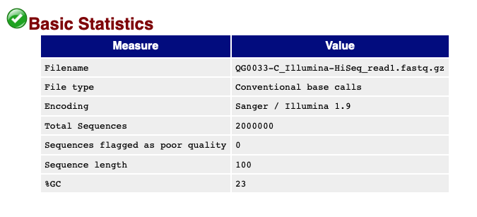
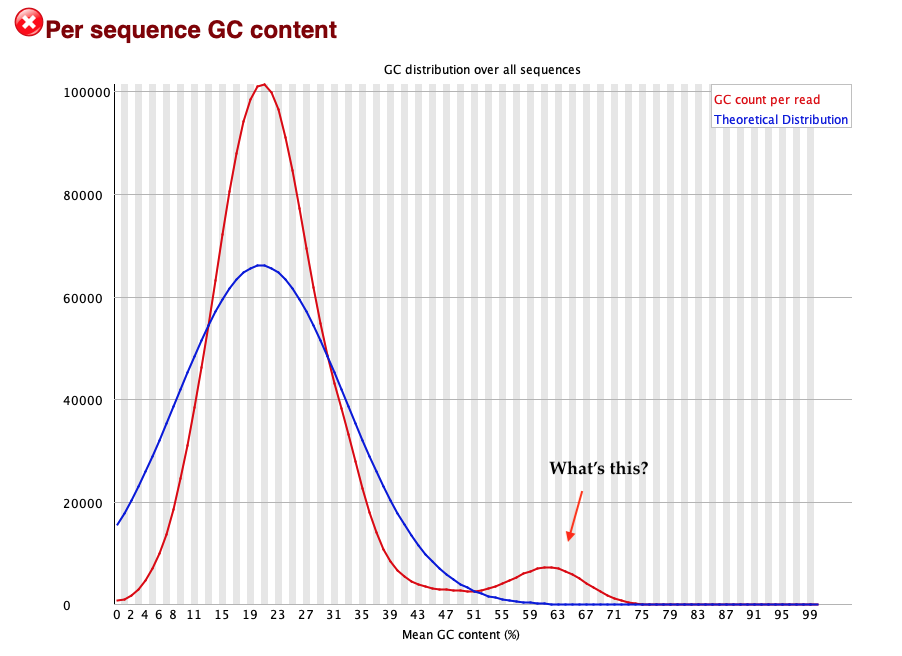

# Step 2: Inspecting sequence data quality

There are a set of analyses that can be carried out directly on a FASTQ file to assess the quality
of sequencing. These include looking for poor quality data, looking for read duplication, assessing
GC content, looking for over-represented sequences and the presence of sequence adapters in reads.
Luckily there are also well-established tools that make running these analyses easy. The one we'll
try is called `fastqc` and it can be run as follows.

## Running `fastqc`

First make a directory for the output and run fastqc:
```
mkdir fastqc_output
fastqc -o fastqc_output malaria/*.fastq.gz
```

This will process both reads and will take a couple of minutes to run.

If you look in the folder now you'll see there are some new files:
```
$ ls fastq_output
QG0033-C_Illumina-HiSeq_read1.fastq.zip
QG0033-C_Illumina-HiSeq_read1.fastq.html
QG0033-C_Illumina-HiSeq_read2.fastq.zip
QG0033-C_Illumina-HiSeq_read2.fastq.html
...
```

`fastqc` has created some `.html` files, as well as some `.zip` files. Look at these by opening the
`.html` files in a web browser.

## A survey of sequencing performance

In the rest of the page below I'm going to look at the `QG0033-C` dataset, which you will have
generated if you followed the instructions above. However, it's useful to see what the output looks
like across datasets - so I collected some.  See:

- a malaria sample sequenced on a HiSeq with an unusual GC bump.  (that's this dataset, described further below). [-> link](https://www.well.ox.ac.uk/~gav/projects/oxford_statgen_summer_school/sequence_data_analysis/fastqc_examples/malaria/QG0033-C_Illumina-HiSeq_read1_fastqc.html#M5) 

- a second malaria sample sequenced on XTEN for which the reads have PCR primer contamination. [-> read 1 link](https://www.well.ox.ac.uk/~gav/projects/oxford_statgen_summer_school/sequence_data_analysis/fastqc_examples/malaria/ERR6227518_Illumina-XTEN_read1_fastqc.html#M9), [read 2 link](https://www.well.ox.ac.uk/~gav/projects/oxford_statgen_summer_school/sequence_data_analysis/fastqc_examples/malaria/ERR6227518_Illumina-XTEN_read2_fastqc.html#M9).

- a human sample sequenced on a Novaseq at the [WHG](https://www.well.ox.ac.uk), for which read 2 is enriched for poly-G sequences. [-> link](https://www.well.ox.ac.uk/~gav/projects/oxford_statgen_summer_school/sequence_data_analysis/fastqc_examples/human/HV31-illumina_novaseq_2_fastqc.html#M9).

- another human sample, sequenced during a fragmentation testing process, that has the same problem but much worse (nearly 3% of reads are like this.) [-> link](https://www.well.ox.ac.uk/~gav/projects/oxford_statgen_summer_school/sequence_data_analysis/fastqc_examples/human/NA12878-illumina_novaseq-NE755566_R2_fastqc.html#M5).  

- The same human sample sequenced [at the NYGC](https://www.ebi.ac.uk/ena/browser/view/ERR3239334?show=reads), where the base qualities have been compressed to a different set of levels.  [-> link](https://www.well.ox.ac.uk/~gav/projects/oxford_statgen_summer_school/sequence_data_analysis/fastqc_examples/human/ERR3239334-Illumina_NovaSeq_6000_read2_fastqc.html#M1).

Have a look at these. All except the last would probably be considered good quality data, but they
all have at least some level of artifacts.

(More examples can be found [on the fastq documentation
page](https://www.bioinformatics.babraham.ac.uk/projects/fastqc/).)

Finally here is an example of [a long-read human dataset](https://www.well.ox.ac.uk/~gav/projects/oxford_statgen_summer_school/sequence_data_analysis/fastqc_examples/human/HV31-PacBio_CCS_fastqc.html) (PacBio Hifi) - this looks quite different.

### Next steps

The rest of this page contains information on what's in this fastqc output. There's lots in here - feel free to read.
When you're ready move on to [align the reads to the reference genome](./Aligning_reads.md).

## Interpreting fastqc output

For `QG0033-C` fastqc has provided us a detailed overview of information it can gain purely from
the fastq files. Let's take a look.

### Basic statistics

The 'Basic statistics' section tells you some stuff you already know - the number of reads, read
length and so on: 



It also tells you the average GC content (the proportion of read bases that are
Gs or Cs). This is around 23%, which is about right because the *P.falciparum* genome [has such
high A/T content](https://doi.org/10.1038/nature01097).

### Per base sequence quality

The 'Per base sequence quality' section is interesting: it suggests that the **quality of
sequencing is lower at the ends of the read**.


Here, this is particularly seen at the start of the read, which is slightly unusual. If you look at
e.g. the results from the data run on XTEN you'll see that it really tails off toward the end of
the read - but that's not so noticeable here.

**Note.** It's important to realise this is the sequencer's estimate of base quality - it's generally
thought pretty good, but is not necessarily fully calibrated.

### Per tile sequence quality

This is a map of the 'tiles' on the flowcell with the average base quality for each tile on the
Illumina sequencer. (Here, a 'tile' is a physical region of a sequencer's flowcell lane that is
imaged to detect bases. Inside each tile will be multiple 'clusters' which, if the chemistry works
out, are each amplified from a single DNA fragment and correspond to one read pair. See the [short
read theory page](Short_read_theory.md) for more on this).

**Question.** How does fastqc know which tile the reads are from?

In this output you can see some tiles that have performed badly (red indicating below average base
quality) but most look pretty good.

### Per-base sequence content

This shows the average proportion of each base in each location in the reads:


Here you see a fairly typical picture, as follows:

* In general *there should be about the same number of G as C bases, and the same number of A as T
  bases*. This is because either strand of DNA ought to be equally likely to be sequenced. In the
  above just under 40% of bases are G or C, and just over 10% are A or T, and it is pretty flat
  across the read. So this looks about right for a malaria genome with ~23% A/T content.
  
* There is nevertheless a skew of base content toward the start of the read. This seems to be
  typical for Illumina sequencing and it could be caused by a number of things. One possibility is
  that there are [biases in the sequence content due to DNA
  fragmentation](https://doi.org/10.1186/s12859-016-0976-y); it's also true that base quality was
  lower at these bases so maybe there is another aspect of the chemistry causing this.
  
### Per-sequence GC content

This plot measures the distribution of G and C bases ('GC' content) in all reads - and for this
sample it looks kind of interesting:



The bump on the left is expected, since *P.falciparum* has around 23% GC content on average. This
varies a bit around the genome so we should expect to see some spread around 23%.

But this sample also has a second bump of reads at around 60% GC. What could this be? Here are some
data points:

* If you look at the [read 2 fastqc output](https://www.well.ox.ac.uk/~gav/projects/oxford_statgen_summer_school/sequence_data_analysis/fastqc_examples/malaria/QG0033-C_Illumina-HiSeq_read2_fastqc.html#M5) file you'll see it there as well.

* It's not seen in other samples (such as those linked above) - so it's something about this sample.

* Human DNA has about 41% GC content, but this is up at 60%... so it's not obviously whole-genome human DNA contamination.

Something fishy is going on... what could it be?

**Note.** This will actually be one of our **[challenge questions](challenges.md)**. Leave it for now as
we'll need to align reads to make progress on it.

### Sequence duplication levels, adapter content and over-represented sequences

Near the end are a set of plots that can provide evidence of contamination or chemistry issues -
such as high levels of duplicaets which could indicate a 'low-diversity' (low DNA quantity input)
library, presence of adapter sequences which could be due to too short fragments, or other
artifacts.

**Note.** The list of possible artifacts is long - see the [paired-end sequencing
theory](Short_read_theory.md) for a description of some of this. (The
[sequencing.qcfail.com](https://sequencing.qcfail.com) site is also a good read if you want a
more in-depth look at problems.) First of these analyses is the sequence duplication plot:


For this sample about 3% of sequences seem to be duplicated.  To interpret this, you should note that

- fastqc is only looking at one of the reads here (not both pairs, which would be a better analysis
  to look for artifacts, because most duplication arising from amplification will be of the whole
  fragment not just one of the ends).

- sequencing errors might make duplicate fragments appear not duplicated, leading to
  underestimation of the number of duplicates. For this reason fastqc focusses on the first 50bp of
  each read, but [as we saw above there can be low-quality bases at the start of the read as well](https://www.well.ox.ac.uk/~gav/projects/oxford_statgen_summer_school/sequence_data_analysis/fastqc_examples/malaria/QG0033-C_Illumina-HiSeq_read1_fastqc.html#M1).

- Some level of 'genuine' duplication is expected in high-coverage data , of course. This is both
  because we are sequencing randomly-placed fragments around the genome that occasionally overlap
  by chance, and because genomes contain repetitive sequence. For more on this see the
  [understanding sequence duplication levels](duplicates.md) page.

The upshot of this particular plot is that there aren't worrying levels of duplicate reads in this
dataset, although because of the low qualities at the start of the read, you might guess this is an
underestimate.

**Note.** It is common to see much higher levels of duplication - for example this
[sequencing of human sample NA12878](https://www.well.ox.ac.uk/~gav/projects/oxford_statgen_summer_school/sequence_data_analysis/fastqc_examples/human/ERR3239334-Illumina_NovaSeq_6000_read2_fastqc.html#M8)
shows around a 20% duplication rate even though it used a PCR-free library preparation.
PCR-based library preparation typically needs to still higher duplication rates.

### Adapter content and over-represented sequences

Finally fastqc has a couple of analyses that search reads for the presence of known adapter and
primer sequences, or other sequences that are unusually over-represented and suggest contamination
or chemistry issues. In brief, adapter sequences can appear in the reads [if the fragments are too
short](Short_read_theory.md) so that the sequencer 'reads through' into the adapters; PCR primers
could appear for example due to primer self-amplification during PCR; other sequences (such as
poly-G sequences) can arise when chemistry for one of the primers fails.

This sample doesn't seem to have any problems here.  But see:

- [this malaria dataset](https://www.well.ox.ac.uk/~gav/projects/oxford_statgen_summer_school/sequence_data_analysis/fastqc_examples/malaria/ERR6227518_Illumina-XTEN_read2_fastqc.html#M9) with PCR primer contamination;
- [this human dataset](https://www.well.ox.ac.uk/~gav/projects/oxford_statgen_summer_school/sequence_data_analysis/fastqc_examples/human/HV31-illumina_novaseq_2_fastqc.html#M9) which has poly-G sequences in the second read.

If you see high levels of artifacts of this type, you may want to try [read trimming](Read_trimming.md) before analysis.

### Next steps

When you've read enough, move on to the section on [aligning reads](./Aligning_reads.md).
