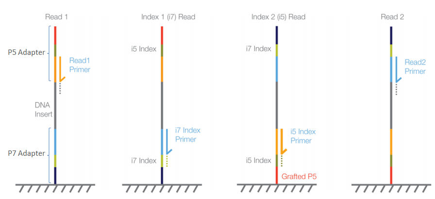

# Appendix 1: Paired-end sequencing in theory and practice

## What paired-end sequence data should lool like

You'll know that typical short-read datasets are made up of pairs of reads representing sequencing
of both ends of short DNA fragments. The basic model is that we should be generating short DNA
fragments that get read from either end like this:

```
        READ 1:    --------> 
  DNA FRAGMENT: 5' ------------------------------------ 3'
        READ 2:                               <--------
```

Read 1 and 2 form what is called a **read pair** (and this is **paired-end sequencing**); this is
important for analysis because we know that they came from the same fragment.

Typical data contains paired-end reads from millions of number of fragments that are of reasonable
size (often around 400-500bp). In an ideal world these would be randomly sampled from around the
genome of interest, so generating approximately uniform coverage.


### What paired-end data actually looks like

In real data things are not quite so simple. To understand this you have to know a bit about the
chemistry. It works like this (I'm describing Illumina sequencing here, other technologies may be
subtly different):

First, the fragment gets extra *adapter sequences* ligated onto the end:

```
  FRAGMENT WITH ADAPTERS: 5' ========-------------======= 3'
```

The fragment is often called the **insert**, since it is "inserted" between the adapter sequences.

The adapters are themselves structured: moving outward from the fragment, they have a *primer
sequence* (that tells the polymerase where to start sequencing), an *index* that identifies the
sample, and then a specific sequence whose job is to anneal to the oligos on the flowcell. So they
look something like this:

```
  FRAGMENT WITH ADAPTERS: 5' OOIIIPPPP--------------PPPPIIIOO 3'
```

Where `O` = oligo-binding sequence, `I` = the sample index, and `P` = the sequencing primer that
indicates the sequencing start point. (The sample index is used to de-multiplex reads from
different samples run on the same lane at the same time - it is read in seperate index cycles.)

If all goes well, the sequencing starts from just after the read 1 primer and ends after a fixed
number of cycles (often 100-150 for high-throughput sequencers). Then the fragment is reversed (by
a slightly complicated process) and read 2 is read in the same way. So we should get this:

```
                  READ 1:             -----> 
  FRAGMENT WITH ADAPTERS: 5' OOIIIPPPP------------------PPPPIIIOO 3'
                  READ 2:                         <-----
```

Here's another picture of the same thing from [Illumina's page on adapter
trimming](https://support.illumina.com/bulletins/2016/04/adapter-trimming-why-are-adapter-sequences-trimmed-from-only-the--ends-of-reads.html):



**Note.** What actually *are* the adapter sequences? This depends on the kit, but you can find out
if you want to - for Illumina has a
[list of adapter and index barcodes](https://support-docs.illumina.com/SHARE/AdapterSeq/Content/SHARE/AdapterSeq/AdapterSequencesIntro.htm).
Tools like `fastqc` use these known sequences to look for adapter contamination.

To generate enough intensity for imaging, the ligated fragments above undergo
*amplification on the flowcell* that generates multiple copies of each fragment - called a
**cluster**. This process keeps the fragments local (they stay within the imaging 'tile') so that
they are imaged together, generating the output sequence data.

Finally, the sequencer proceeds to sequence each read in **cycles**. In each cycle, travelling in
from the primer, the polymerase incorporates a single flourescently-labelled base complementary to
the insert, and an image is taken to capture the colour of the incorporated base. Then, in the next
cycle the flourescent label is removed which allows the subsequent base to be incorporated, and so
on until the read is complete.

**Note.** See the [useful links page](Useful_links.md) for links to other resources on sequencing.

### So what goes wrong?

Well here are a few common issues:

#### The fragments are too short

If the fragments are too short you'll start to see **overlapping reads**, **adapter contamination**,
or maybe **failed sequencing bases**.

This is because the reads may start to look like this:

```
                  READ 1:             --------> 
  FRAGMENT WITH ADAPTERS: 5' OOIIIPPPP--------------PPPPIIIOO 3'
                  READ 2:                  <--------
```

or this:

```
                  READ 1:             --------> 
  FRAGMENT WITH ADAPTERS: 5' OOIIIPPPP---PPPPIIIOO 3'
                  READ 2:       <--------
```

Or maybe even this:

```
                  READ 1:                --------------> 
  FRAGMENT WITH ADAPTERS: 5'    OOIIIPPPP--PPPPIIIOO
                  READ 2:    <-------------
```

The reads end up with bits of overlapping sequence, read-through into the adapters, or even read
right off the end of the sequence.

(What happens in the last case depends a bit on which sequencer is being used. Recent machines such
as the Novaseq use a '2-color' imaging process, which does not distinguish between a G base and a
lack of intensity, so this type of read-through leads to long sequences of apparent 'G' bases in
the reads.  See the [QC page](Quality_control.md) for some examples.

#### The adapter chemistry goes wrong

There's a bit of asymmetry in the process between the two reads. This is because if the read 1
chemistry doesn't work out, then the fragment may not anneal to the flowcell so won't start a cluster at all. But if read 2
chemistry doesn't work out we'll get artifacts in the second read. Some examples of that are [on
the QC page](Quality_control.md) where a fraction of read pairs read 2 entirely composed of `G`
bases. (As in
[this sample](https://www.well.ox.ac.uk/~gav/projects/oxford_statgen_summer_school/sequence_data_analysis/fastqc_examples/human/HV31-illumina_novaseq_2_fastqc.html#M9),
sequenced during workflow testing, for which I presume the read 2 primers are not properly ligated leading to low intensities for
the second read.

#### The library has too little input DNA

If the library has too little input DNA then we will end up sequencing the same fragments over and
over again - generating **duplicate reads**.

This occurs because of duplication of the same fragments by the PCR process, and it means we will
get high levels of **duplicate reads**. (This is often referred to as a 'low diversity' library,
but note this is not referring to *genetic diversity* or the actual genetic makeup of the sample -
it is just about about how well the genome is represented by random fragments.)

**Note.** Some level of duplication is expected anyway, both by random chance of where fragments
are sequenced, and because genomes contain repetitive sequence. Howeer, an important feature of
artifactual duplicates above is that they sequence the **exact same fragment**, so both read 1 and
read 2 will appear to be duplicated. Because there is generally a spread of fragment sizes, this is
very unlikely even for high-coverage sequencing.

#### There is spillover between clusters

Even with PCR duplicates, some clusters on the flowcell may end up large enough that they get
imaged as two or more clusters. (Another version of this is that the original amplified fragment
moves off and forms another nearby cluster.) This has the effect of also generating duplicate reads
- known as **optical duplicates**. (One way to detect these is identical or very similar reads that
lie in nearby physical locations.) These duplicates occur even if the library preparation does not
use PCR amplification. See
[sequencing.qcfail.com](https://sequencing.qcfail.com/articles/illumina-patterned-flow-cells-generate-duplicated-sequences/)
for an analysis of this.

#### Incorporation of bases gets out of sync

The sequencing process relies on generating large clusters of identical DNA molecules that are all
imaged together. However, as the process proceeds along the read, it can happen that the different
copies get out of 'sync'. As the read proceeds this affects a larger and larger subset of the
copies leading to **worse sequencing toward the end of the read**. This is often reflected in the
lowered base qualitites.

#### The fragmentation / chemistry introduces biases

It is thought that common fragmentation methods themselves introduce bias in the DNA content at the
start of the fragments. It is generally true that there is some bias in the GC content of the first
few bases in the reads, as seen in this file.

### Next steps

Now get back [back to the practical](Pipeline_outline.md#the-practical-in-a-nutshell), or
see the [examples on the QC page](./Quality_control.md/#a-survey-of-sequencing-performance).
