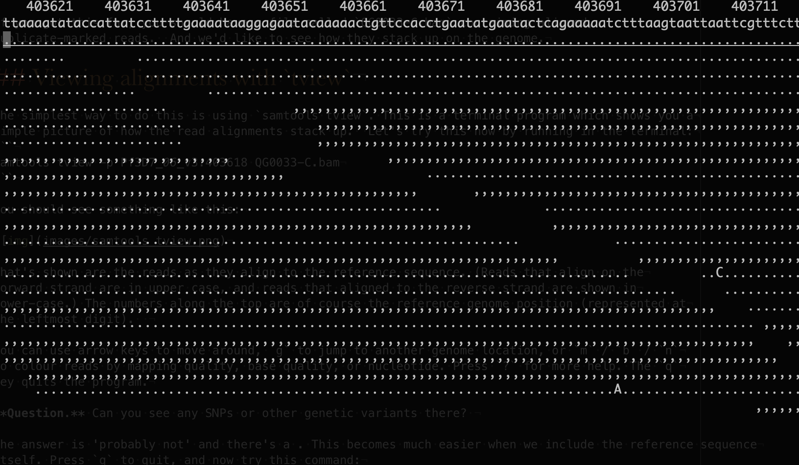

# Step 4: Viewing alignments

If you got this far, you should have a file called `QG0033-C.bam` containing aligned,
duplicate-marked reads.  And we'd like to see how they stack up on the genome.

## Viewing alignments with `tview`

The simplest way to do this is using `samtools tview`. This is a terminal program which shows you a
simple picture of how the read alignments stack up.  Let's try this now by running in the terminal:
```
samtools tview -p Pf3D7_07_v3:403818 QG0033-C.bam
```

You should see something like this:


What's shown are the reads as they align to the reference sequence. (Reads that align on the
forward strand are in upper case, and reads that aligned to the reverse strand are shown in
lower-case.) The numbers along the top are of course the reference genome position (represented at
the leftmost digit; so position 403,618 is at the left of the screen).  

You can use arrow keys to move around, `g` to jump to another genome location, or `m` / `b` / `n`
to colour reads by mapping quality, base quality, or nucleotide. Press `?` for more help. The `q`
key quits the program.

**Question.** Can you see:

* A sequencing error?
* A SNP or other genetic variant? 
* Something that looks like a misalignment?

The answer to the above is 'probably not' at the moment. This becomes much easier when we include the reference sequence
itself. Press `q` to quit, and now try this command:
```
samtools tview -p Pf3D7_07_v3:403818 QG0033-C.bam Pf3D7_v3.fa
```

*Now* you'll see something more like this:


Now dots and commas mean 'reads with the same base as the reference' (dots for forward strand,
commas for reverse strand) - anything else means a mismatching base.  

**Question.** scroll around a bit. Can you find a probable sequencing error? A SNP or other genetic
variant? A possible misalignment?

**Note.** I focussed on this particular region because it's within the *CRT* gene on chromosome 6.
Mutations in these gene at 403,618-403,625 are confer resistance to the antimalarial chloroquine.
Does this parasite have these mutations?

**Note.** If you look at other variable sites - for example, Pf3D7_02_v3:631190 which is one of the
alleles [thought to be associated with infections of individuals carrying the sickle
haemoglobin](https://doi.org/10.1038/s41586-021-04288-3) - you'll see something a bit funny. It
looks like this may be a **mixed infection**. (That is, it might be two or more strains of parasite
in the same infection. This happens if someone is bitten twice by two infected mosquitos, or if the
mosquito itself has a mixture of parasites.) I'm thinking this because around half the reads have
an `A` allele and the other half have a `T` allele at the site. This is also seen at other
sickle-associated alleles like `Pf3D7_02_v3:814288`.

### Congratulations!

Congratulations - you have reached the end of this tutorial on handling next-generation sequencing data.

At around 12pm we will move on to looking at a range of data types and visualising them using IGV. If you have time
before then, please feel free to look at the [challenge questions](./Challenge_questions.md) or the [bonus tutorial on
estimating sequencing error rate](./De_novo_error_rate_estimation.md)


