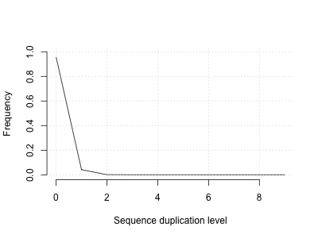

# Appendix 2: understanding sequence duplication levels

Duplicates arise naturally in sequencing from random fragments that just happen to have
the same breakpoints. However, as explained a bit more on the [paired-end sequencing theory](Short_read_theory.md)
page, they also arise artifically from amplification and other
chemistry artifacts, so it makes sense to assess levels of duplication in the data. That's what
this plot does. Here, it says that most reads are not duplicated, but a few appear twice or more.

Does that look sensible? Well, if we sequence a genome to a high level of coverage we'll of course
get some duplicates just by chance. To assess that, let's ignore the paired end-y-ness for a moment
and imagine sequencing the malaria genome with 2 million single-end 100 base pair reads. We could
simulate that by just choosing random read start points - here's a bit of R code that does that:

```
# make sure to run this in an R session - not in the terminal!

simulate_duplicates = function( genome_size, number_of_reads ) {
  # Sample read start locations
  read_locations = sample( 1:genome_size, size = number_of_reads, replace = T )
  # tabulate where the reads hit and make a histogram.
  reads_per_location = table( read_locations )
  M = max( max( reads_per_location ), 10 )
  # Make a histogram
  h = hist(
    reads_per_location,
    breaks = 0.5 + 0:M,
    plot = FALSE
  )
  # Count duplicates (one per each additional copy)
  duplicates = sum( 1:(M-1) * h$counts[2:M] )
  return( list(
    duplicate_rate = duplicates / number_of_reads,
    histogram = h
  ))
}

d = simulate_duplicates( 23E6, 2E6 )
```

This returns a duplication rate of about 4% - let's plot it:

```
plot(
  1:10,
  d$histogram$density * 100,
  xlab = "Sequence duplication level",
  ylab = "Proportion (%)",
  type = 'l',
  ylim = c(0, 100),
  bty = 'n'
)
```

This shows:



So we ought to get some duplicates anyway - even if everything else was perfect. (In reality,
sequence coverage is far from uniform so we could expect a higher number of duplicates; on the
other hand sequencing errors can make detection less sensitive.)

Second, fastqc **does not take into account the read pairs here** - it analyses each fastq file
seperately. Artifically-generated duplicates generally duplicate the whole fragment, meaning that
**both read 1 and read 2 should be duplicated.**  So fastqc might *overestimate* the duplication rate.

Third, genomes contain duplicated sequence anyway, so some level of duplication is expected.

My hunch is that the 3% duplication rate output by fastqc above is an underestimate. You could try
comparing the [number of reads that are marked as duplicates](Aligning_reads.md) in the alignment section.


