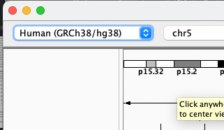
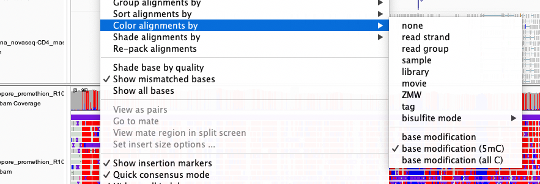

# Guess the dataset!

In this section we will have a quick tour through several types of genomic sequencing, using data from a single sample.

To run this tutorial you will need the [IGV desktop application](https://igv.org) installed - or work with someone who does.

To get IGV, go to [the download page](https://software.broadinstitute.org/software/igv/download) and download and install the appropriate version. (The ones with Java included are
simplest, but there's a bigger download.)

Start up IGV and make sure you have selected the 'Human (GRCh38/h38)' genome build from the drop-down at the top left:

Now search for a gene by typing it into the search box and pressing &lt;enter&gt; - a good one to start with is *FUT2*, which is on chromosome 19.

The datasets enclosed are all from a single individual, codename *HV31*. If you want to read more about what we used that data for, see [this
paper](https://doi.org/10.1371/journal.pcbi.1009254).  

:::caution Warning

For this practical we've only extracted data for a subset of genes. If you can't see any data, it might be because you're in the wrong part of the genome.
To re-orient yourself, try entering one of these genes in the search box:

* *FUT2*
* *FUT1*
* *APOE*
* *CD14*
* *UBASH3A*
* *G6PD*

:::

## Instructions

We have a set of 6 datasets for you to explore, all from a single individual. The catch is: we're not telling you what they are.

:::info Loading datasets into IGV

For each dataset there is a **dataset link**.  To load this into IGV, do this:

1. Select 'Load from URL' from the file menu at the top of the screen.
2. Copy and paste in the dataset URL into the 'File URL' box
3. Paste it again into the 'Index URL' box, and add `.bai`.
4. Press 'OK'

You should see the data loaded into a new track.

:::

## The datasets
### Dataset A: Illumina paired-end DNA sequencing

**Dataset link:** <small>`https://tinyurl.com/4zrm6pme/datasetA.bam`</small>

You should be familiar with this one by now, as it's what the [earlier practical](../basic_sequence_data_analysis/README.md) was all about. The data has
150bp paired-end reads and was generated on the [Illumina Novaseq 6000](https://emea.illumina.com/systems/sequencing-platforms/novaseq.html) platform.

:::tip IGV hint

    
See hint

Try the 'view as pairs' option in the context menu (by right-clicking on the white area of the track) to see the pairs of reads linked together.

:::

### Dataset B: Illumina RNA-seq

**Dataset link:** <small>`https://tinyurl.com/4zrm6pme/datasetB.bam`</small>

This is similar to the DNA sequencing, but for (messenger) RNA instead of DNA.

For the most part it's only genes that get transcribed to mRNA, and only exons that end up in the mature mRNA. So you should see clear patterns of reads above exons and much less
coverage elsewhere.

Different genes are expressed to different amounts, however, so you might have to look at a few genes to really see what this looks like.

:::tip IGV hint

The coverage tracks have 'Autoscale' turned on - the scale is printed at the top-left of the track, as shown here:

Keep this in mind when comparing genes or tracks for RNA-seq data - the scale will vary a lot as you move around the genome.

:::

### Dataset C: PacBio long-read DNA sequencing

**Dataset link:** <small>`https://tinyurl.com/4zrm6pme/datasetC.bam`</small>

The PacBio platform generates long, multi-kilobase reads of unamplified single DNA molecules. These molecules are internally corrected by circular consensus sequencing, so that the
eventual reads have high accuracies comparable to Illumina sequencing. 

### Datasets D and E: Nanopore long-read DNA sequencing

**Dataset link:** <small>`https://tinyurl.com/4zrm6pme/datasetD.bam`</small>
**Dataset link:** <small>`https://tinyurl.com/4zrm6pme/datasetE.bam`</small>

The Nanopore platform (here the PromethION) also generates very long, multi-kilobase reads of unamplified DNA molecules.
There are two datasets: dataset D shows the older R9.4.1 chemistry data, while dataset E shows the newer R10.4.1 chemistry data.
Dataset E should have higher quality i.e. fewer errors.

:::tip IGV hint

Because Nanopore and Pacbio work with unamplified DNA, they can also measure DNA modifications as well as DNA bases - that is, epigenetics as well as genetics.
To turn on base modification colours, right-click on a track, choose 'Color alignments by' and choose 'base modification (5mC)', as shown here:

The modifications shown are 5-methylcytosine. They mainly occur at 'C' bases in CpG sites. Transcribed gene bodies tend to be methylated (red), while active gene promoters (up to
around the first exon) tend to be unmethylated (blue), unless the gene is switched off.

:::

### Dataset F: 10X linked-read sequencing ###

**Dataset link:** <small>`https://tinyurl.com/4zrm6pme/datasetF.bam`</small>

Yet another type of data is linked-read sequencing. This is Illumina short-read sequencing, but including molecular 'barcodes' that allows the technology to link the reads together.

:::tip IGV hint

To see the barcode linking, you need to turn on 'Linked read view (BX)' in the context menu. (To make this easy to see, you may also then need to choose 'Group alignments by -> None' and then 'Collapsed' from
the same menu.)

At this point you should be able to see multiple reads linked together by thin lines - the linked reads all come from the same DNA fragment.
:::
