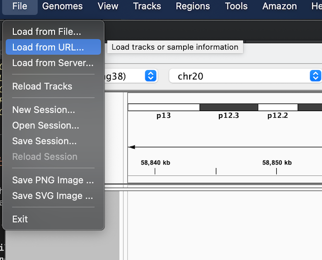
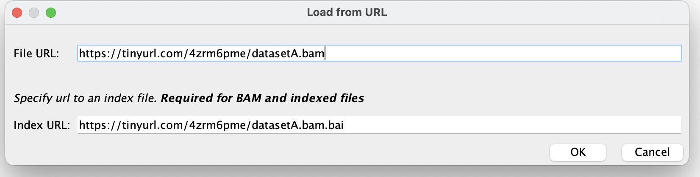

# A sightseeing tour of sequence data

In this section we will have a quick tour through several types of genomic sequencing, using data from a single sample.

To run this tutorial you will need the [IGV desktop application](https://igv.org) installed - or work with someone who does.

To get IGV, go to [the download page](https://software.broadinstitute.org/software/igv/download) and download and
install the appropriate version. (The ones with Java included are simplest, but have a bigger download.)

Start up IGV and make sure you have selected the 'Human (GRCh38/h38)' genome build from the drop-down at the top left:

Now search for a gene by typing it into the search box and pressing &lt;enter&gt; - a good one to start with is *FUT2*,
which is on chromosome 19.

The datasets enclosed are all from a single individual, codenamed *healthy volunteer 31* (HV31). If you want to read
more about sequencing of that individual, see [this paper](https://doi.org/10.1371/journal.pcbi.1009254).

:::tip Note

For this practical we've generated files that only cover a subset of genes, in order to keep them small. If you can't
see any data at any point, it might be because you're in the wrong part of the genome. To re-orient yourself, try
entering one of these genes in the search box:

* *FUT1* and *FUT2* on chromosome 19
* *APOE*, also on chromosome 19
* *CD14*
* *UBASH3A*
* *G6PD*
* *GNAS*

:::

:::caution Warning

**Please note** that all data in this sightseeing tour is included strictly for training purposes - it is **not**
publicly-available data. Please **do not** share outside this course.
Contact me (Gavin Band) if you have any queries about this.

:::

## Instructions

We have a set of 6 datasets for you to explore, all from *HV31* genome. The first is a paired-end Illumina sequencing
data much like what we have been analysing so far today.

For each dataset you'll see a pair of URLs like this:

**File URL**: `https://tinyurl.com/4zrm6pme/datasetA.bam`
**Index URL**: `https://tinyurl.com/4zrm6pme/datasetA.bam.bai`

To load these into IGV, do the following:

1. Select 'Load from URL' from the file menu at the top of the screen.

2. Copy and paste in the dataset URL into the 'File URL' box.

3. The 'index URL' is just the same as the file url, with '.bai' added.  Copy and paste or type it in.

4. Press 'OK'

You should see the data loaded into a new track.

:::

## The datasets

Ok we are ready!  Let's go:

* Load [dataset A](./dataset_a.md) - Illumina short-read genomic sequencing.
* Load [datasets B and C](./dataset_b.md) - Nanopore and PacBio long-read genomic sequencing.
* See [base modifications](./dataset_c.md) in the long-read data.
* Load [dataset D](./dataset_d.md) - Illumina RNA-seq, from CD14+ monocytes and other cells.
* Load [Dataset E](./dataset_e.md) - Illumina ATAC-seq.
* And load [Dataset F](./dataset_f.md) - Illumina sequencing of 10X linked-read libraries.

