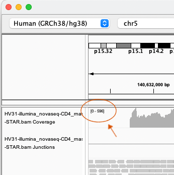

# Late morning: A sightseeing tour of sequence data

In this section we will have a quick tour through several types of genomic sequencing, using data from a single sample.

To run this tutorial you will need the [IGV desktop application](https://igv.org) installed - or work with someone who does.

To get IGV, go to [the download page](https://software.broadinstitute.org/software/igv/download) and download and
install the appropriate version. (The ones with Java included are simplest, but have a bigger download.)

Start up IGV and make sure you have selected the 'Human (GRCh38/h38)' genome build from the drop-down at the top left:

Now search for a gene by typing it into the search box and pressing &lt;enter&gt; - a good one to start with is *FUT2*,
which is on chromosome 19.

The datasets enclosed are all from a single individual, codenamed *healthy volunteer 31* (HV31). If you want to read
more about sequencing of that individual, see [this paper](https://doi.org/10.1371/journal.pcbi.1009254).

:::caution Warning

For this practical we've generated files that only cover a subset of genes, to keep them small. If you can't see any
data at any point, it might be because you're in the wrong part of the genome. To re-orient yourself, try entering one
of these genes in the search box:

* *FUT1* and *FUT2* on chromosome 19
* *APOE*, also on chromosome 19
* *CD14*
* *UBASH3A*
* *G6PD*
* *GNAS*

:::

## Instructions

We have a set of 6 datasets for you to explore, all from *HV31* genome. The first is a paired-end Illumina sequencing
data much like what we have been analysing so far today.

For each dataset you'll see a pair of URLs like this:

**File URL**: `https://tinyurl.com/4zrm6pme/datasetA.bam`
**Index URL**: `https://tinyurl.com/4zrm6pme/datasetA.bam.bai`

To load these into IGV, do the following:

1. Select 'Load from URL' from the file menu at the top of the screen.

2. Copy and paste in the dataset URL into the 'File URL' box.

3. The 'index URL' is just the same as the file url, with '.bai' added.  Copy and paste or type it in.

4. Press 'OK'

You should see the data loaded into a new track.

:::

## The datasets

Ok we are ready!  Let's go:

* [Dataset A](./dataset_a.md) - Illumina short-read genomic sequencing
* [Dataset B](./dataset_b.md) - PacBio long-read genomic sequencing
* [Dataset C](./dataset_c.md) - Nanopore long-read genomic sequencing
* [Dataset D](./dataset_d.md) - Illumina RNA-seq, from CD14+ monocytes
* [Dataset E](./dataset_e.md) - Illumina RNA-seq, from CD19+ B cells
* [Dataset F](./dataset_f.md) - ATAC-seq, from CD14+ monocytes

### Dataset A: Illumina paired-end DNA sequencing

**Dataset link:** <small>`https://tinyurl.com/4zrm6pme/datasetA.bam`</small>

:::

### Dataset B: Illumina RNA-seq

**Dataset link:** <small>`https://tinyurl.com/4zrm6pme/datasetB.bam`</small>

This is similar to the DNA sequencing, but for (messenger) RNA instead of DNA.

For the most part it's only genes that get transcribed to mRNA, and only exons that end up in the mature mRNA. So you should see clear patterns of reads above exons and much less
coverage elsewhere.

Different genes are expressed to different amounts, however, so you might have to look at a few genes to really see what this looks like.

:::tip IGV hint

The coverage tracks have 'Autoscale' turned on - the scale is printed at the top-left of the track, as shown here:

Keep this in mind when comparing genes or tracks for RNA-seq data - the scale will vary a lot as you move around the genome.

:::
