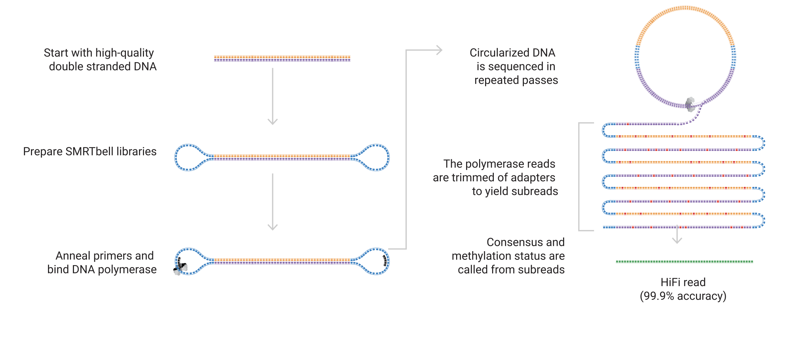

# Datasets B and C: long reads

**Dataset B URL**:
```
https://tinyurl.com/3chwns49/nanopore.bam
```
**Dataset C URL**:
```
https://tinyurl.com/3chwns49/pacbio.bam
```
(For index URLs, add `.bai`).

Datasets B and C are **single-molecule long-read sequencing** data of genomic DNA. The DNA was extracted from peripheral
blood mononuclear cells from *HV31* and sequenced on:

* an Oxford Nanopore Technologies' [PromethION](https://nanoporetech.com/products/promethion) machine, for Dataset B.
* and a [PacBio Sequel IIe](https://www.pacb.com/technology/hifi-sequencing/sequel-system/latest-system-release/) machine for, for Dataset C.

Long-read sequencing is quite a bit different to Illumina sequencing - it is pretty interesting.

## How long-read sequencing works

Nanopore and PacBio are the two main competing long-read platforms currently. They have both similarities and differences.

**Nanopore** works by drawing single-stranded DNA through tiny pores. An electrical ion current is flowing through the
pore.  As the bases go through, they block the current depending on their shape, which allows the base to be measured.


The image above is from [Wang et al (2021) doi:10.1038/s41587-021-01108-x](https://doi.org/10.1038/s41587-021-01108-x).


**PacBio** instead works by trapping individual DNA molecules in tiny wells, called zero-mode waveguides, with an RNA
polymerase. The polymerase incorporates flourescent bases and the flouresence is measured. However, one difference is
that PacBio circularises the molecules before sequencing, allowing it to form consensus 'HiFi' reads that typically have very high accuracy.



The image above is from the [PacBio webpage on HiFi sequencing](https://www.pacb.com/technology/hifi-sequencing/).

Unlike Illumina, which uses cluster amplification, both platforms read the DNA of single molecules and this brings with it some interesting differences:

* the reads can be longer - a raw read can typically be tens of kilobases in length - sometimes even longer.
* in both platforms, the sequencing happens more or less as fast as the molecule can be sequenced - no lock-step style blocking of bases to stay in sync.
* the DNA is not amplified, so things like base modifications (i.e. epigenetics) can also be measured.

## Questions

**Easy question**:

Look at the secretor status SNP chr19:48703417 G>A.  Do all the datasets agree?  What is the sample genotype at this SNP?

**Challenge question**:

Zoom in to chr19:48703417 G>A until you are looking at indiviual bases. Can you figure out what the mutation does to the protein?

**Structural variant question**:

Long-read data are great for looking at structural variants.  Can you figure out what's happening at each of these regions?

- `chr19:50,573,786-50,580,358`
- `chr19:48,571,195-48,571,234`
- `chr19:55,205,183-55,211,755`
- `chr19:55,447,950-55,449,600`

:::tip IGV Tip

Try turning on 'Link supplementary alignments' in the context menu to see how different alignments of single reads join up.

*Supplementary alignments* arise when a read aligns in two or more parts, that are not close enough together to be
treated as a single alignment. (The exact conditions under which an alignment is split into a primary and supplementary
alignment like this, depend on the alignment method used.)

It often makes sense to see these alignments together, especially when looking at structural variants.

:::