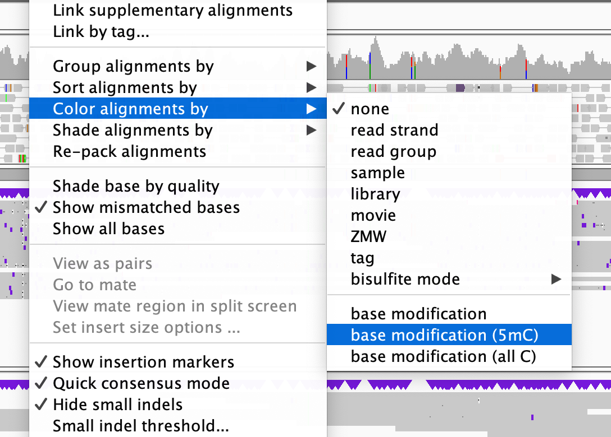

# DNA modifications

One of the amazing things about long-read sequencing is that it can measure DNA modifications, as well as just DNA bases.

In particular, both PacBio and Nanopore data now support calling of 5-methylcytosine (5mC), which is a DNA modification
that is associated with repression of gene transcription.

:::tip IGV tip

To see methylation data, use the context menu (right-click on the long-read tracks) and choose 'Color alignments by -> base modification (5mC)':

You should see the reads light up in blue (unmethylated) and red (methylated) - showing the calls of methylation made on each read.

:::

Methylation varies quite a bit but in the human genome, a typical picture is that most 'C' bases in the genome are
methylated (red).  But the 'C' bases upstream of transcribed genes (promoter and first exon) ten to be unmethylated (i.e. blue).

## Questions

* Look at some genes to see if that's what you see.

* Also zoom right in to base level - what does it look like when zoomed in?

* Try looking at these genes: *UBASH3A* and *GNAS* - what do you make of the methylation patterns?

