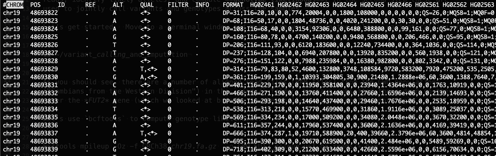
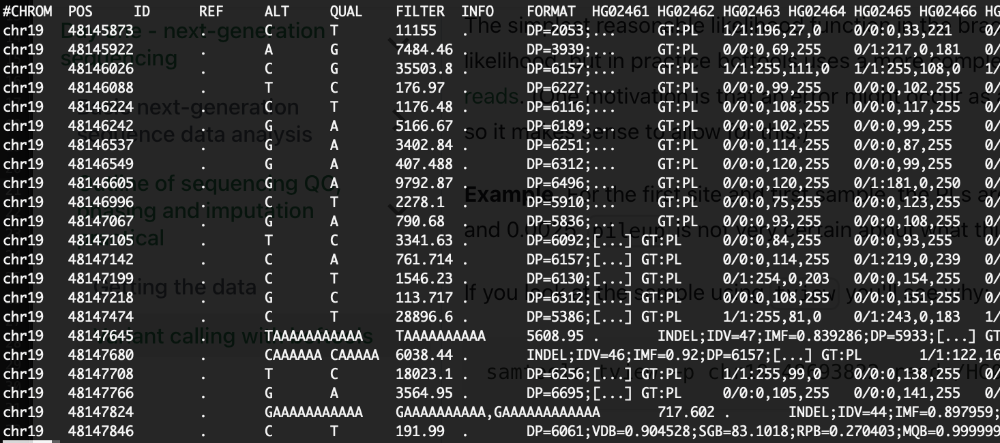

# Variant calling with bcftools

First let's see how to use a simple pipeline to identify genetic variants
using [bcftools mpileup](http://samtools.github.io/bcftools/bcftools.html#mpileup)
and [bcftools call](http://samtools.github.io/bcftools/bcftools.html#call).

As this suggests the process has two steps. In the first step (the *mpileup step*), we process the
reads, identify likely alleles, and compute **genotype likelihoods**. In the second *calling* step
these are used to jointly call variants and genotypes across the samples.

Let's get started. Move to a terminal window and make sure you are in the folder
`variant_calling_and_imputation`:

```
cd ~/variant_calling_and_imputation
```

As you should see, there are a number of aligned read files (BAM files) from the GWD population
("Gambians from the Western Division") in the `reads/` folder. We have subsetted these down so they
cover the *FUT2* gene (which we looked at briefly in the challenge question this morning).

Let's use `bcftools` to compute genotype likelihoods:

```
bcftools mpileup -Oz -f GRCh38_chr19.fa.gz  -o GWD_FUT2_pileup.vcf.gz reads/*.bam
```

**Note.** This will take a minute or so to run, as the command reads all the alignment files and
the FASTA reference sequence, and inspects the pileup much like we did manually this morning. 

Let's go straight ahead and implement calling:

```
bcftools calls -m -v -Oz -o GWD_FUT2_calls.vcf.gz GWD_FUT2_pileup.vcf.gz
```

**Note.** The `-m` option means 'use the newer multi-allele calling algorithm', and `-v` means
'only output variant sites'. In both commands we wrote `-Oz` to mean 'output compressed VCF format'.

### Inspecting the pileup and calls output

Both the pileup and call steps output a [Variant Call Format
(VCF)](https://en.wikipedia.org/wiki/Variant_Call_Format) file. What's the difference? Look first
at the pileup file using `zless`:

```
zless -S GWD_FUT2_pileup.vcf.gz
```

The first lines in the file (the ones starting with a `#` character) are all *metadata*. They're
useful but let's skip them for now. The easiest way to do this is search for 'CHROM' which you can
do by pressing `/` (forward slash) followed by `CHROM`, and then press enter. You should see
something like this:



Feel free to scroll around a bit.  A few things to note:

* `bcftools mpileup` has looked at every site in the region (from 48693822 to 48708100, as it
  happens) and assessed the evidence for variation at each one.

* The 4th and 5th columns tell you what alleles `mpileup` thinks are present in the reads. The 4th
  column is the reference sequence base, and the 5th is are the other alleles seen (with `<*>`
  standing for 'anything else').

* The 8th column is called `INFO` and contains a bunch of information about the variants across all
  samples. Exactly what is in there is described in the metadata, but for example you should be
  able to see values called `DP`. This is the **total depth of reads** observed across all samples
  at the site.  Other metrics similarly capture properties of the read pileup.
  
* The per-sample data itself starts way over in the 10th column. The values are **PHRED-scaled
  genotype likelihoods** for each possible genotype for the given alleles.
  
**Note.** If there are $k$ alleles listed, then there are $k \choose 2$ possible genotypes (for a
diploid human individual). This is why some rows have many more values than others - more alleles
were seen in the reads.

**Note.** The PHRED-scaled likelihood (PL) for a particular genotype $g$ is computed as
$$
\text{PL}(g) = -10 \log_10\left( P\left( \text{read data} | \text{genotype} = g \right) \right)
$$

The simplest reasonable likelihood function in the bracket here would be something proportional to a binomial likelihood, but
in practice bcftools uses a more complex likelihood that
[allows for error dependency between reads](https://academic.oup.com/bioinformatics/article/27/21/2987/217423?login=true).
(One motivation is that an error might occur as an alignment error or be sequence
context-dependent, so it makes sense to allow for this.)

**Example.** For the first site and first sample, the PLs are 0, 3, 26. That translates to
likelihoods of about 1, 0.5, and 0.0025.  `pileup` is not very certain about what this genotype is!

If you look at the sample using `tview` you'll see why:
```
samtools tview -p chr19:48693822 reads/HG02461.final_FUT2.bam
```
Only two reads cover this position in this sample - they're both `A` bases,
but more reads would be needed to be really confident this is a homozygous `A`.

### Inspecting the calls output

Now look at the calls file:
```
zless -S GWD_FUT2_calls.vcf.gz
```

Again skip past the metadata by typing `/CHROM` and pressing ENTER.  You should see something like this:



(NB. I've shrunk the INFO data in the above image to make it easier to see - your file will no doubt have a
bunch of stuff in there).

A few points to note:

* The file only has a subset of sites in it - those where `bcftools` thinks there is genuine variation.
* The `<*>` alleles are gone.  They were just there to enable the calling step to sum evidence across samples.
* The PLs are still there - but now they are joined by genotype calls in the `GT` field.

Scroll down the file a bit. Can you find a multi-allelic variant? (i.e. several alleles in column
5?) What about a multi-allelic SNP (rather than an indel?)

### Interpreting the GT field

It's pretty simple. A `0` corresponds to the reference allele, a `1` corresponds to the first
alternative allele, and so on. For a diploid sample the genotypes are of the form `0/0` (homozygous
reference), `0/1` (heterozygous for the first alternative allele) `1/1` homozygous for the first
alternative allele, and so on.

By and large these genotypes correspond to the **maximum likelihood genotype** (as you can tell by
comparing to the PL fields... remember we're looking for the *smallest* PL because of the PHRED
scaling.)  However, if there aren't many reads the genotype may also be influenced by the prior.

### Questions

How many of your variants are SNPs?  How many are INDELs?  How many are multi-allelic and how many bi-allelic?

### Next steps

The rest of this practical is about using the wealth of information `bcftools` has returned to turn
this initial set of variant calls into a robust set of phased genotypes. We'll then apply that to
impute a second set of samples. For this purpose we'll use a set of calls on a larger genomic
region, that you can find in the file `calls/GWD_30X_calls.vcf.gz`.

When you're ready [go back to the practical](README.md#Steps_in_the_practical).

