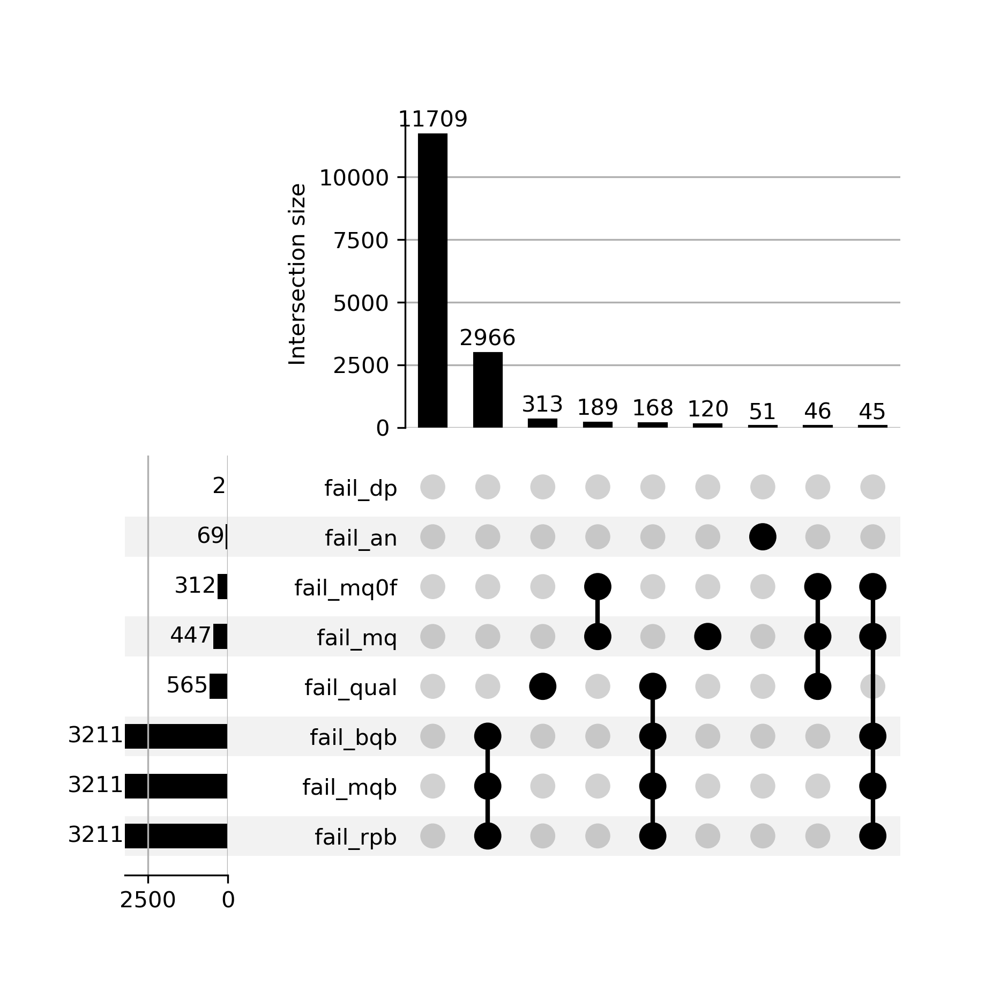

# Variant quality control

For variant quality control we'll start with the output of `bcftools` call and use the various INFO
fields to thin down to a more robust set of variants. (In doing this it's worth pointing out that
the underlying data is pretty good here - it's 30X coverage data from an Illumina Novaseq
[carried out recently by the New York Genome Center](https://www.internationalgenome.org/data-portal/data-collection/30x-grch38)
- so variant calling is generally pretty good.  Nevertheless for best results in downstream analyses it's worth weeding out
any fake variants as much as we can.

## Examining the variant call quality metrics

Let's start by looking at what header fields we have available.  Still working in the terminal, try:

```
zcat calls/GWD_30x_calls.vcf.gz | grep "^##.*INFO"
```

**Note.** That's using `zcat` to decompress the file, and `grep` to find metadata lines that start with '##FORMAT'
or '##INFO' - using a [regular expression](https://en.wikipedia.org/wiki/Regular_expression).

You should see this:
```
##INFO=<ID=INDEL,Number=0,Type=Flag,Description="Indicates that the variant is an INDEL.">
##INFO=<ID=IDV,Number=1,Type=Integer,Description="Maximum number of raw reads supporting an indel">
##INFO=<ID=IMF,Number=1,Type=Float,Description="Maximum fraction of raw reads supporting an indel">
##INFO=<ID=DP,Number=1,Type=Integer,Description="Raw read depth">
##INFO=<ID=VDB,Number=1,Type=Float,Description="Variant Distance Bias for filtering splice-site artefacts in RNA-seq data (bigger is better)",Version="3">
##INFO=<ID=RPB,Number=1,Type=Float,Description="Mann-Whitney U test of Read Position Bias (bigger is better)">
##INFO=<ID=MQB,Number=1,Type=Float,Description="Mann-Whitney U test of Mapping Quality Bias (bigger is better)">
##INFO=<ID=BQB,Number=1,Type=Float,Description="Mann-Whitney U test of Base Quality Bias (bigger is better)">
##INFO=<ID=MQSB,Number=1,Type=Float,Description="Mann-Whitney U test of Mapping Quality vs Strand Bias (bigger is better)">
##INFO=<ID=SGB,Number=1,Type=Float,Description="Segregation based metric.">
##INFO=<ID=MQ0F,Number=1,Type=Float,Description="Fraction of MQ0 reads (smaller is better)">
##INFO=<ID=AC,Number=A,Type=Integer,Description="Allele count in genotypes for each ALT allele, in the same order as listed">
##INFO=<ID=AN,Number=1,Type=Integer,Description="Total number of alleles in called genotypes">
##INFO=<ID=DP4,Number=4,Type=Integer,Description="Number of high-quality ref-forward , ref-reverse, alt-forward and alt-reverse bases">
##INFO=<ID=MQ,Number=1,Type=Integer,Description="Average mapping quality">
```

What this is saying is that in the INFO field (column 8) we will have a lot of information.
This includes basic information about the reads:

* The total sequencing *depth* (`DP`) - that is, the number of reads which cover the variant.
* The average mapping quality (`MQ`) of reads covering the locus
* The fraction of mapping quality zero reads (`MQ0F`) (i.e. reads whose alignment is very uncertain).
* The number of forward and reverse-orientation reads with each allele (`DP4`).

It also contains information about the called genotypes:

* The number alternate alleles in the called genotypes (`AC`)
* The total number of alleles in the called genotype (`AN`).  For this high-coverage data, this is
generally equal to twice the sample size, i.e. 328, because it's rare to have no coverage at a site.

Finally it contains a number of statistical tests reflecting basic null hypotheses that we might
hope to be true if the variant is real:

* A test (`RPB`) that the variant alleles are similarly distributed in terms of position in the reads

* A test that reads with each allele have similar mapping qualities (`MQB`) or base qualities (`BQB`).

* A 'segregation-based metric' (details [here](https://samtools.github.io/bcftools/rd-SegBias.pdf))
  which reflects a likelihood ratio test that the non-reference alleles are concentrated in a
  subset of samples (consistent with a true variant) as opposed to uniformly distributed across
  samples (i.e. more consistent with sequencing errors.)

Here's what that looks like for the first putative variant in the file:
```
bcftools view -H calls/GWD_30x_calls.vcf.gz | head -n 1 | cut -f8 | tr ';' '\n'
```

**Note.** This uses `bcftools view -H` to output the data rows skipping the metadata, `head` to
extract the first row, `cut` to pull out the 8th column and `tr` to turn semicolons into newlines so we can read it.  It produces:
```
DP=2053
VDB=0
SGB=172.684
RPB=0.388264
MQB=1
MQSB=1
BQB=0.195049
MQ0F=0
AC=108
AN=328
DP4=695,649,346,315
MQ=60
```

So, across samples there are 695 forward and 649 reverse-orientation reads with the reference
allele, and 346 and 315 with the alt allele. (This is only 2,005 so there are presumably 48 reads
with other alleles as well - possibly due to errors.) None of these reads have mapping quality zero
and there is little evidence of position, mapping or base quality bias. And the average mapping
quality is 60 - pretty good!  

**Question.** What is the allele frequency? (Hint: use the `AC` and `AN` fields.)

### Plotting the metrics
  
To examine these in more detail let's load them into python. Because the VCF format is a bit
complex, the simplest way is to use `bcftools` to extract the fields in a table. That can be done
in the terminal like this:

```
bcftools query -f '%POS\t%DP\t%QUAL\t%SGB\t%RPB\t%MQB\t%MQSB\t%BQB\t%MQ0F\t%AC\t%AN\t%MQ\n' calls/GWD_30x_calls.vcf.gz > GWD_30x_variant_info.tsv
```

(I've removed `VDB` which is for RNA-seq data.)

To look at this in python we'll be using the [pandas dataframe library](https://pandas.pydata.org)
to manipulate data and the `os` module to handle the filesystem.

**Switch to a python notebook** now and let's get started by importing these and changing to the right directory:

```python
# in a python notebook, not the terminal!
import os
import pandas as pd
os.chdir( "variant_calling_and_imputation")
```

Now let's use pandas to load the VCF data:
```python
info = pd.read_csv(
    'GWD_30x_variant_info.tsv',
    sep = '\t', 
    names = ['pos','dp','qual','sgb','rpb','mqb','mqsb','bqb','mq0f','ac','an','mq'],
    na_values = ['.']
)

print(info)

print(info.shape[0]) # the number of rows, i.e. variants
```

Let's also import the field names for reference:
```python
columns_to_plot = [
    'dp', # 'Raw read depth',
    'mq', #'Average mapping quality'
    'mq0f', # 'Fraction of MQ0 reads\n(smaller is better)',
    'ac', # 'Allele count in genotypes for each ALT allele, in the same order as listed',
    'an', # 'Total number of alleles in called genotypes',
    'qual', # 'Phred-scaled quality score for the assertion made in ALT',
    'rpb', # 'Mann-Whitney U test of Read Position Bias\n(bigger is better)',
    'mqb', # 'Mann-Whitney U test of Mapping Quality Bias\n(bigger is better)',
    'bqb', # 'Mann-Whitney U test of Base Quality Bias\n(bigger is better)',
    'mqsb', # 'Mann-Whitney U test of Mapping Quality vs Strand Bias\n(bigger is better)',
    'sgb', # 'Segregation based metric'
]
```

We are ready to plot the values of the metrics across all variants in the file. There are 11
metrics in total (I removed the RNA-seq specific one), so in the next code we use
[matplotlib](https://matplotlib.org) to create a multi-panel plot made up of 11 'subplots'. Then we
iterate through the fields and histogram them.

```python
import matplotlib.pyplot as plt
fig, axs = plt.subplots(figsize=(24,16), nrows = 3, ncols = 4 )
for i, f in enumerate(columns_to_plot):
    _ = axs[i//4,i%4].hist( info[f], 50 )
    _ = axs[i//4,i%4].set_xlabel( f.upper() )
    axs[i//4,i%4].set_title( f.upper() )
plt.tight_layout()
```

**Note.** If you want to save the figure, you can do it using `savefig()`.  Like this:

```python
os.makedirs("plots", exist_ok = True )
plt.savefig( "plots/GWD_30x_calls.variant_info.png', dpi=300 )
```

If you stare at these plots for a while you should see:

* The total depth is generally around 6,000 but some variants have much lower depth (and some much higher) - both are suspicious.
* Most variants have few mapping quality zero reads - but some have up to around 10% or higher.  This is suspicious too.
* All the statistical tests have a big spike near zero - that is, evidence for biases.  Suspicious!
* The allele count varies quite a bit - most called variants are rare but for a few variants, the alternate allele is common.  (This is not really suspicious.)
* Lastly the QUAL metric varies a lot too, with many variants having quite low QUAL scores.

**Note.** As described in lectures, the QUAL metric is a PHRED-scaled estimate of the probability the site is not a true variant.  It is:
$$
-10 * log_{10} \left( P( \text{site is not a true variant with these alleles}|\text{reads})\right)
$$

So a value of zero corresponds to complete certainty that the site is not a variant, a value of 10
corresponds to about 10% chance the site is not a variant, and so on. 

### Filtering variants

We will use a simple ad-hoc approach to filter variants: we'll pick some thresholds based on the above plot.
Here's a python way to do that:
```python
thresholds = {
    'dp': ('>=', 1000),  # Assume at least 1000x read depth across our 164 samples
    'mq': ('>=', 40),    # Average mapping quality at least 40
    'mq0f': ('<=', 0.1), # Assume < 5% reads are mapping quality 0
    'ac': ('>=', None),  # Assume we have seen in at least 2 samples.
    'an': ('>=', 300),   # At least 90% of genotypes called
    'qual': ('>=', 50),  # Assume QUAL>50, i.e. 1 in 100,000 chance it's not a variant.
    'rpb': ('>=', 0),    # Mann-Whitney U test of Read Position Bias,
    'mqb': ('>=', 0),    # Mann-Whitney U test of Mapping Quality Bias,
    'bqb': ('>=', 0),    # Mann-Whitney U test of Base Quality Bias,
    'mqsb': ('>=', 0),   # Mann-Whitney U test of Mapping Quality vs Strand Bias
    'sgb': ('', None),   # Segregation based metric - ignore for now
}
```

We'll add condition failure status as columns in the `info` data frame.
```python
for field, (comparison, threshold) in thresholds.items():
    column_name = 'fail_%s' % field
    if threshold is not None:
        if comparison == '>=':
            info[ column_name ] = ~(info[field] >= threshold)
        elif comparison == '<=':
            info[ column_name ] = ~(info[field] <= threshold)

print(info)
```            

### How did filtering perform?

A useful way to see what those filters did is to create an *upset plot*. This will let us see how
many variants each filter excluded, and how they link together.  For that we need another library:
```
from upsetplot import UpSet, from_indicators
```

Let's also capture just the filtering columns from our dataframe and plot:
```
filter_columns = [c for c in info.columns if 'fail_' in c]
filter = info[ filter_columns ]

upset_format = from_indicators( filter.columns, filter )
UpSet( upset_format, min_subset_size=20, sort_by='cardinality', show_counts=True )
```

You should see something like this:


What's plotted here are as follows. Look at the lower panel first. For each filter metric, there's
one row, and the bar on the left shows the number of variants that fail that metric. The
blobs then indicates all the different combinations of filters that failed together. Finally, the top
plot shows the number of variants that fail each of these combinations.

For example, in the plot above, 11,709 variants do not fail any filters; 2,966 fail bqb, mpb, rpb only, etc.

**Question.** What happens if you change the `min_subset_size` in the above?

**Question.** Try changing thresholds in the `thresholds` dict to see how that changes the result.
In particular it might make sense to:

* filter on the various P-values (`rpb`, `mqb`, `bqb` and `mqsb`). Values in the range 0.00001 -
  0.001 might be appropriate.
  
* We might want to insist that the variant is seen in at least two samples. This could be done by
  assuming `AC>1`.

* Maybe 10% is too many reads with mapping quality zero - we might want a more aggressive filter here.


Reach a set of filters that you think are **defensible**. You should expect to filter out the worst-performing
variants, but still retain most variants in the data.


**Note.** To avoid artifacts, it actually makes sense to filter out variants where the coverage is
too high (as well as too low). In this data, the coverage is around 30x and there are 164 samples,
so generally we expect around 5000x coverage. Sites with (say) twice that coverage are probably
artifacts due to misalignment of reads to repetitive sequence.  

**Challenge coding question** for python experts only! Update the above code to allow filtering on both
low and high coverage.  (Otherwise you can add this by hand in the `bcftools` command below.)

### Setting the filters in stone.

We will now use the `bcftools filter` command to actually filter out the variants. First let's turn
our chosen thresholds into an appropriate string.  The string we need is:

```
bcftools_filters = [
 '%s%s%f' % ( field.upper(), quality, threshold )
 for field, ( equality, threshold ) in thresholds.items()
 if threshold is not None
]

print( ' & '.join( bcftools_filters ))
```

It should look something like this (depending on your filters):
```
DP>=1000 & DP<=10000 & MQ>=40 & MQ0F<=0.05 & AN>=300 & AC>=2 && QUAL>=50 & RPB>=0.0001 & MQB>=0.0001 & BQB>=0.0001 & MQSB>=0.0001
```

Copy that string and head back to your terminal window.  We will now filter the variants:

```
bcftools filter -Oz \
-i '[PUT YOUR FILTER STRING HERE]' \
-o 'GWD_30x_calls.filtered.vcf.gz'
```
for example:
```
bcftools filter -Oz \
-i 'DP>=1000 & DP<=10000 & MQ>=40 & MQ0F<=0.05 & AN>=300 & AC>=2 && QUAL>=50 & RPB>=0.0001 & MQB>=0.0001 & BQB>=0.0001 & MQSB>=0.0001' \
-o 'GWD_30x_calls.filtered.vcf.gz'
```

**Note.** The backslashes (`\`) are *line continuation characters*.  The above is all one command.

Finally count the variants in the original and filtered file:
```
bcftools view calls/GWD_30x_calls.vcf.gz | wc -l
bcftools view GWD_30x_calls.filtered.vcf.gz | wc -l
```

**Question** Does this match your upset plot?  How many variants are filtered out?

### Variant calling - challenge questions

Here are two questions that will help you to understand *why* variants fail the filters.

**Question 1**. Pick a variant that fails one of the filters. Find a sample or samples that was
called with the alternate allele and use `samtools tview` to inspect the pileup. Is it clear why
the variant failed the filter?

**Note.** To use the supplied BAM files you will have to take variants in the range
`chr19:48693971-48707951`.

**Question 2**. In the lectures we learned that the ratio of transitions to transversions (Ts/Tv)
can be used to assess the quality of a set of variant calls. (Transitions are interchanges of
two-ring purines (A<->G) or one-ring pyramidines (C<->T). Transversions are mutations which change
between purines and pyramidines. See [this
page](https://www.mun.ca/biology/scarr/Transitions_vs_Transversions.html) for more details). Ts/Tv
is should generally be around 2 or higher in a robust set of variant calls. **What is the Ts/Tv for
this data before and after filtering?**

(**Note.** I suggest focussing only on bialellic SNPs here).

### Next steps

Congrulations! You have now carried out some basic variant quality QC. Go back to [the
practical](README.md) and move on to phasing.
