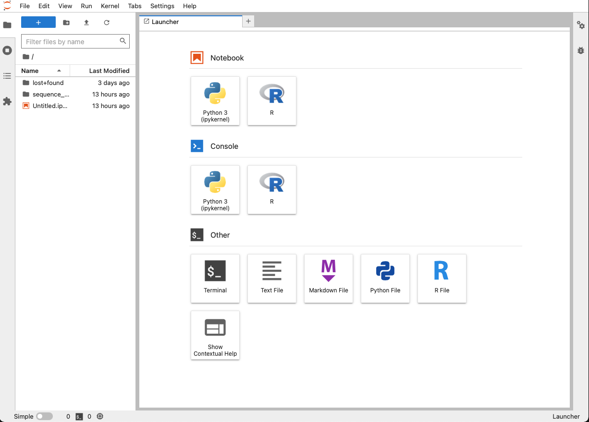

# Getting started on JupyterHub

For the practicals you will need to be logged into
[statgenschool.bmrc.ox.ac.uk](https://statgenschool.bmrc.ox.ac.uk). Please make sure you have
signed up and can log in. (You do this by visiting the site, clicking on 'Signup!', and creating a
username and password.  One of the course tutors will then approve you.)

Once in, choose the appropriate image and wait a few seconds for it to start up. It should look
something like this:

### Switching images

You will also need to be running the appropriate image for each day.  **To switch images:**

1. Choose 'Hub Control Panel' from the `File` menu.
2. Click 'Stop My Server' (if it appears)
3. Now click 'Start My Server' ...
4. ... and choose the appropriate image for the day of the week.

With luck you will now be logged into your own personal JupyterHub image with the needed
requirements for that day.
